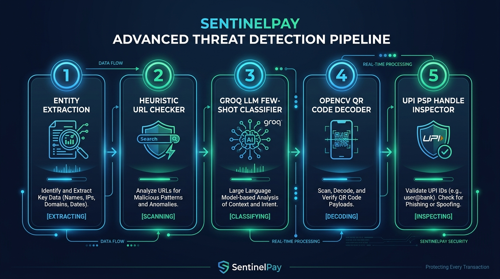
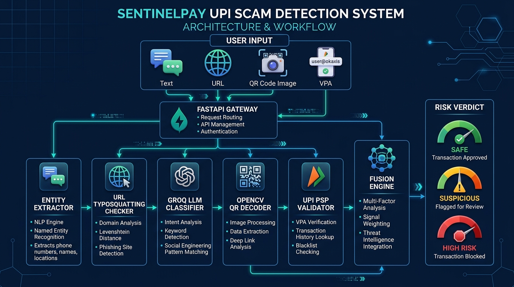
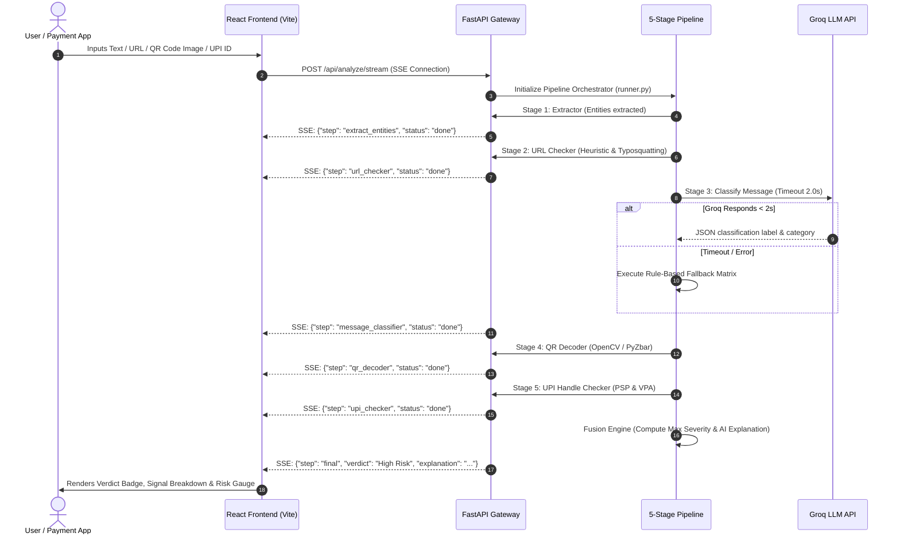

# 🎯 SentinelPay — Project Presentation Deck

---

## 📌 Slide 1: Title Slide

### **SentinelPay**
#### *Real-Time AI-Powered UPI Scam Detection & Multi-Modal Risk Analysis System*

* **Category**: Cybersecurity / AI in FinTech / Digital Payments Safety
* **Objective**: Protecting millions of digital payment users from UPI fraud, QR code scams, phishing URLs, and social engineering before money leaves their account.
* **Tagline**: *"Pre-transaction Intelligence for Zero-Trust Payments"*

---

## 🚨 Slide 2: Problem Statement

### **The Growing Menace of Digital Payment Scams in India**

1. **Explosive Growth of UPI Transactions**: India processes over **10+ Billion UPI transactions monthly**, making it the world's largest real-time payment network.
2. **Rising Cyber Fraud & Financial Losses**:
   * Over **₹1,000+ Crores lost annually** to UPI fraud, social engineering, and phishing.
   * **QR Collect Scams**: Unsuspecting users scan QR codes believing they will *receive* money, but instead enter their PIN and get debited.
   * **KYC & Bank Impersonation**: SMS messages claiming account suspension with deceptive links (`sbi-update.xyz`).
   * **Typosquatting & Homoglyphs**: Deceptive domain lookalikes visually indistinguishable from official bank domains.
3. **The Core Gap**: Traditional banking security alerts users *after* a fraud attempt or only checks static blocklists, leaving a critical vulnerability window for new scams.

---

## 🛡️ Slide 3: Proposed Solution

### **SentinelPay: Pre-Transaction Multi-Modal AI Security Engine**

* **Zero-Trust Pre-Execution Security**: Analyzes transaction intent *before* the user opens their UPI app or enters their 4/6-digit PIN.
* **Multi-Modal Threat Detection**: Concurrently analyzes raw text messages, suspicious URLs, QR code images, and VPA/UPI handles.
* **Real-Time Streaming Verdicts**: Delivers instant risk assessment (**Safe**, **Suspicious**, or **High Risk**) with **<500ms latency** via Server-Sent Events (SSE).
* **Explainable AI**: Translates complex technical security signals into plain-English reasoning so everyday users understand *why* a transaction is dangerous.

---

## ⭐ Slide 4: Key Features

### **Comprehensive Fraud Prevention Capabilities**

1. **Multi-Input Scanning Console**:
   * **Text & SMS Inspector**: Detects urgency phrases, authority impersonation, and fake reward claims.
   * **Hyperlink Analyzer**: Evaluates TLDs, domain age, typosquatting distance, and URL shortener obfuscation.
   * **Computer Vision QR Decoder**: Decodes `upi://pay` deep-links, flags ₹1 collect scam hooks, and detects embedded phishing URLs.
   * **UPI Handle (VPA) Inspector**: Validates PSP handle authenticity (`@okaxis`, `@ybl`, `@sbi`) and flags suspicious keywords (`kyc-help`, `refund-care`).
2. **Live 5-Stage Pipeline Visualizer**: Shows real-time stage progress, execution timestamps, and transparent threat attribution.
3. **Interactive Demo Preset Suite**: Pre-configured test scenarios (Safe OTP, Phishing Link, QR Collect Scam, Fake Investment, Winner SMS).
4. **Analytics & Historical Intelligence**: Live threat distribution metrics, severity breakdowns, and audit trails.

---

## 🛠️ Slide 5: Tech Stack

### **Enterprise-Grade Modern Architecture**

| Layer | Technology | Key Role |
| :--- | :--- | :--- |
| **Frontend UI** | **React 18 + Vite** | Ultra-responsive, glassmorphism UI with real-time SSE stream parsing |
| **Styling** | **Custom Vanilla CSS** | Vibrant dark-navy theme, responsive grid, dynamic micro-animations |
| **Backend Framework** | **FastAPI (Python 3.11)** | High-throughput async ASGI gateway with non-blocking streaming |
| **AI / LLM Engine** | **Groq Cloud API (`llama-3.3-70b-versatile`)** | Few-shot NLP classification with 2.0s strict timeout guard |
| **Computer Vision** | **OpenCV (`cv2`) + PyZbar** | QR matrix decoding & `upi://pay` parameter extraction |
| **Heuristic Analytics** | **Levenshtein Distance & `tldextract`** | Typo-squatting detection & domain structural analysis |
| **Data Layer** | **Seed Data Engine** | Known bank domains, 40+ legitimate PSP handles, suspicious TLD dictionaries |

---

## 🔬 Slide 6: Technical Approach

### **Hybrid AI + Heuristic Intelligence Pipeline**



```
┌─────────────────────────────────────────────────────────────────────────┐
│                        SENTINELPAY RISK PIPELINE                        │
└─────────────────────────────────────────────────────────────────────────┘
   │
   ├── 1. REGEX ENTITY EXTRACTION
   │    └── Extracts URLs, VPAs, Phone Numbers, Amounts & Urgency Keywords
   │
   ├── 2. HEURISTIC URL CHECKER (10-Signal Analysis)
   │    └── Typosquatting (Levenshtein), Homoglyphs, TLD risk, Shorteners
   │
   ├── 3. GROQ LLM MESSAGE CLASSIFIER (with 2s Fallback Guard)
   │    └── Few-shot prompt classification + Rule-based fallback matrix
   │
   ├── 4. OPENCV COMPUTER VISION QR DECODER
   │    └── Decodes upi://pay parameters & flags Re1 collect scam hooks
   │
   ├── 5. VPA & PSP HANDLE CHECKER
   │    └── Validates 40+ Indian PSP handles & flags scam local-parts
   │
   └── 6. MAX-SEVERITY FUSION & AI EXPLAINER
        └── Computes final verdict + plain-English explanation
```

---

## 🔄 Slide 7: Workflow

### **End-to-End System Workflow Architecture**





---

## 📈 Slide 8: Impact and Benefits

### **Transforming Digital Payment Security**

1. **User Empowerment & Financial Protection**:
   * Direct defense against financial loss before money is transferred.
   * Clear, non-technical explanations build user awareness against evolving scam tactics.
2. **Zero Downtime & Ultra-Low Latency**:
   * Sub-500ms pipeline execution ensures no friction in payment user experience.
   * Deterministic rule-based fallback guarantees reliability even during network/LLM API outages.
3. **Seamless FinTech Integration Potential**:
   * Modular API design enables easy integration into existing UPI apps (PhonePe, Google Pay, Paytm, BHIM) as a pre-transaction SDK / API filter.
4. **Scalable & Future-Proof**:
   * Extensible pipeline architecture allows instant addition of new threat signals, AI models, or threat intelligence feeds.

---
