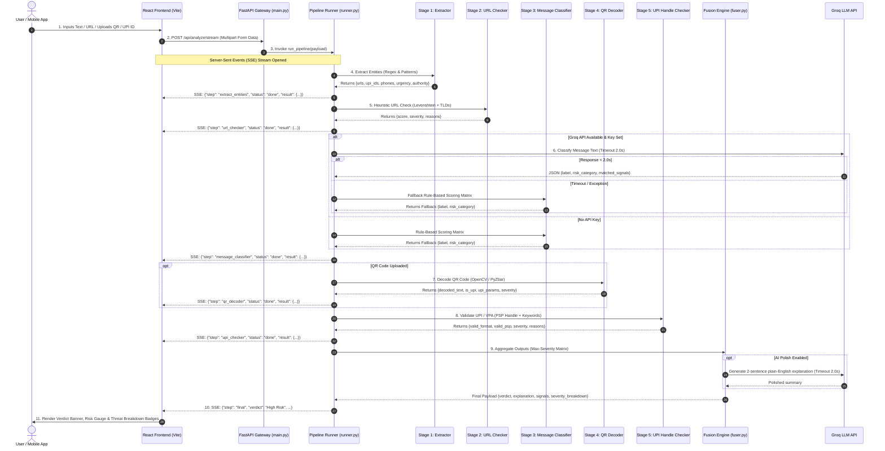

# 🔄 SentinelPay — End-to-End System Workflow


---

## 📌 Executive Summary

**SentinelPay** operates as a zero-trust pre-transaction security engine. It intercepts user input (SMS text, web link, QR code image, or Virtual Payment Address), runs it through a 5-stage parallel-assisted pipeline, and streams real-time threat verdicts to the user interface in **<500ms**.

---

## 🔄 High-Level Sequence Diagram



---

## 🛠️ Step-by-Step Data Flow Breakdown

```
[ USER INPUT ]
   │
   ├── Raw SMS / Message Text
   ├── Suspicious Hyperlink (URL)
   ├── Image File (QR Code Image)
   └── Direct UPI ID (e.g., sbi-refund@okaxis)
   │
   ▼
[ FASTAPI API GATEWAY ] ──(multipart/form-data)──► [/api/analyze/stream]
   │
   ▼
[ PIPELINE RUNNER (runner.py) ]
   │
   ├──► STAGE 1: ENTITY EXTRACTOR (extractor.py)
   │    ├── Regex extraction of URLs, UPI IDs, Phone Numbers
   │    ├── Matches urgency keywords ("immediately", "blocked")
   │    └── Detects authority impersonation ("RBI notice", "Cyber Cell")
   │
   ├──► STAGE 2: HEURISTIC URL CHECKER (url_checker.py)
   │    ├── Checks TLD against suspicious TLD dictionary (.xyz, .top)
   │    ├── Levenshtein distance typosquatting (e.g., sbi.co.in vs sbi-kyc.com)
   │    ├── Homoglyph lookalike character detection
   │    └── URL shortener unmasking (bit.ly, t.co)
   │
   ├──► STAGE 3: MESSAGE CLASSIFIER (message_classifier.py)
   │    ├── Calls Groq LLM (llama-3.3-70b-versatile) with strict JSON schema
   │    └── Circuit Breaker: 2.0s timeout falls back to Rule Engine
   │
   ├──► STAGE 4: COMPUTER VISION QR DECODER (qr_decoder.py)
   │    ├── OpenCV (cv2) + PyZbar image decode
   │    ├── Parses upi://pay deep-link parameters (pa, pn, am, tn)
   │    └── Flags Re1 / ₹1 collect scam hooks & non-UPI phishing web links
   │
   ├──► STAGE 5: UPI HANDLE CHECKER (upi_checker.py)
   │    ├── VPA syntax check (local_part@psp)
   │    ├── Validates PSP handle against 40+ known Indian PSPs (@okaxis, @ybl, @sbi)
   │    └── Local-part keyword risk flags ("refund", "kyc", "support")
   │
   ▼
[ FUSION & EXPLAINER ENGINE (fuser.py) ]
   │
   ├── Computes Max-Severity Verdict: Safe (0) < Suspicious (1) < High Risk (2)
   ├── Compiles Flat Threat Signal Attribution List
   └── Polishes plain-English explanation with Groq (or fallback template)
   │
   ▼
[ REAL-TIME SSE RESPONSE STREAM TO CLIENT ]
```

---

## 🛡️ Circuit Breaker & Fallback Architecture

To ensure **100% uptime and sub-500ms response times** during live demonstrations and production:

1. **Groq LLM 2.0-Second Timeout**: If Groq Cloud experiences network latency or API outage, the system instantly switches to deterministic rule-based matrix scoring without throwing an error.
2. **Per-Stage Exception Isolation**: Every pipeline stage (`Stage 1` through `Stage 5`) is wrapped in its own `try...except` block. If an individual stage fails, it returns a safe default result and allows remaining stages to complete.
3. **Graceful Degraded Mode**: If a QR code image cannot be decoded (e.g. blurry image), the pipeline skips Stage 4 gracefully while continuing URL and UPI handle validation.

---

## 📊 Sample Real-Time SSE Stream Output Payload

```json
// Stage Event Stream
data: {"step": "extract_entities", "status": "done", "result": {"urls": ["http://sbi-verify.xyz"], "urgency_phrases": ["immediately"]}}
data: {"step": "url_checker", "status": "done", "result": {"score": 85, "severity": "high", "reasons": ["Suspicious TLD: '.xyz'", "Typosquat of 'sbi'"]}}
data: {"step": "message_classifier", "status": "done", "result": {"label": "High Risk", "risk_category": "Phishing / KYC Scam"}}
data: {"step": "upi_checker", "status": "done", "result": {"severity": "safe", "reasons": []}}

// Final Verdict Stream
data: {
  "step": "final",
  "verdict": "High Risk",
  "explanation": "🛑 Multiple high-confidence scam signals were detected. This message uses urgent language and links to a deceptive phishing domain (sbi-verify.xyz). Do NOT click or pay.",
  "signals": [
    {"source": "extractor", "signal": "Urgency phrase: 'immediately'", "severity": "suspicious"},
    {"source": "url_checker", "signal": "Suspicious TLD: '.xyz'", "severity": "high"},
    {"source": "url_checker", "signal": "Typosquat of 'sbi.co.in' (edit distance 1)", "severity": "high"}
  ],
  "severity_breakdown": {
    "extractor": "suspicious",
    "url_checker": "high",
    "message_classifier": "high",
    "qr_decoder": "safe",
    "upi_checker": "safe"
  }
}
```
