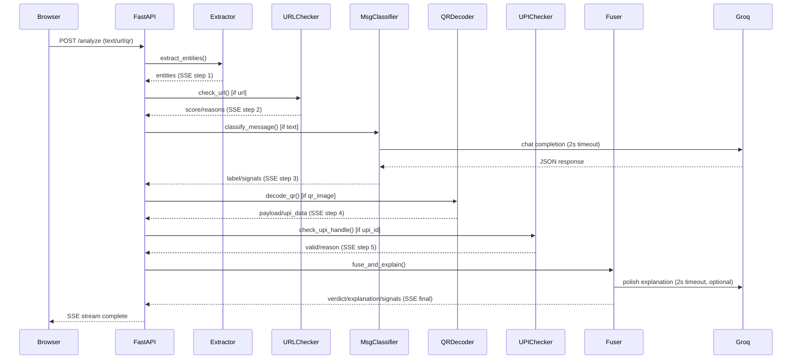

# SentinelPay — Implementation Plan

## Overview

**SentinelPay** is a real-time UPI scam detection and risk analysis system. It accepts suspicious messages, URLs, QR code images, and/or transaction descriptions, runs them through a multi-step analysis pipeline, and streams results live as an agent trace in a web UI, returning a final `Safe / Suspicious / High Risk` verdict.

The design is ruthlessly demo-safe: every external call degrades gracefully within 2 seconds, the pipeline never hangs, and a cached fallback ensures the demo always shows something good even if Groq is rate-limited.

---

## User Review Required

> [!IMPORTANT]
> **Groq API Key required**: You must have a Groq API key ready. Paste it into `.env` as `GROQ_API_KEY=...` after the scaffold is generated. Get a free key at https://console.groq.com. The pipeline works without it (rule-based fallback activates automatically), but the LLM-polished explanations require it.

> [!IMPORTANT]
> **Model choice**: Using `llama-3.3-70b-versatile` on Groq free tier. Rate limit is ~30 req/min. Each analysis uses at most 2 Groq calls (classify + polish). Well within limits for a demo.

> [!NOTE]
> **No LangGraph**: Using a plain `async def run_pipeline()` generator that yields SSE dicts per step. Simpler, more reliable, zero framework risk. The live trace UI provides the same "wow-factor" regardless.

---

## Open Questions

> [!NOTE]
> These are already resolved per the spec — documenting for clarity:
> - WHOIS/PhishTank: feature-flagged, `ENABLE_LIVE_LOOKUPS=true` by default but auto-disables after first timeout
> - QR decode: `cv2.QRCodeDetector` only (no pyzbar)
> - No browser extension, no DB, no ML training
> - Frontend: `fetch()` + `ReadableStream` for SSE (NOT `EventSource` which is GET-only)

---

## Proposed Changes

### Component 1 — Repository Scaffold

#### [NEW] `.env.example`
Template with all env var keys (no values).

#### [NEW] `.gitignore`
Standard Python + Node ignores, includes `.env`.

#### [NEW] `README.md`
Quick-start instructions, demo commands.

---

### Component 2 — Backend (`backend/`)

**Stack**: Python 3.11, FastAPI, uvicorn, Groq SDK, opencv-python, tldextract, python-Levenshtein

#### [NEW] `backend/requirements.txt`
```
fastapi
uvicorn[standard]
python-dotenv
groq
opencv-python-headless
tldextract
python-Levenshtein
httpx
python-multipart
```

#### [NEW] `backend/main.py`
FastAPI app entry point. Registers routes, sets CORS for `localhost:5173`, mounts `/analyze` (POST, SSE) and `/health` (GET).

#### [NEW] `backend/config.py`
Loads `.env`, exports `GROQ_API_KEY`, `ENABLE_LIVE_LOOKUPS`, `GROQ_MODEL`, `GROQ_TIMEOUT_S`.

#### [NEW] `backend/seed_data.py`
All static data from §7:
- `LEGIT_BRAND_DOMAINS` — typosquat reference list
- `LEGIT_PSP_SUFFIXES` — valid UPI handle suffixes
- `SUSPICIOUS_TLDS` — TLD blocklist
- `HOMOGLYPH_MAP` — confusable Unicode chars
- `URL_SHORTENERS` — known shortener domains
- `URGENCY_PHRASES` — regex patterns
- `FEW_SHOT_EXAMPLES` — the 12 examples for the Groq prompt

#### [NEW] `backend/pipeline/extractor.py`
`extract_entities(text: str) -> dict` — regex-based, no LLM.
Extracts: URLs, UPI IDs, phone numbers, amounts (₹/Rs.), urgency phrases, authority-impersonation phrases, unsolicited-payment patterns.

#### [NEW] `backend/pipeline/url_checker.py`
`check_url(url: str) -> dict` — returns `{score, severity, reasons}`.
Implements all weighted heuristics from §4.2. Optional WHOIS/PhishTank behind feature flag with 2s timeout guard.

#### [NEW] `backend/pipeline/message_classifier.py`
`classify_message(text: str) -> dict` — Groq call with few-shot prompt.
Returns `{label, risk_category, matched_signals}`.
Fallback: rule-based classification using extracted flags if Groq times out.

#### [NEW] `backend/pipeline/qr_decoder.py`
`decode_qr(image_bytes: bytes) -> dict` — OpenCV QR decode.
Parses `upi://pay?...` params (pa, pn, am). Generic URL payloads → auto-flag High Risk.

#### [NEW] `backend/pipeline/upi_checker.py`
`check_upi_handle(upi_id: str) -> dict` — validates PSP suffix against `LEGIT_PSP_SUFFIXES`. Returns `{valid, reason}`.

#### [NEW] `backend/pipeline/fuser.py`
`fuse_and_explain(all_outputs: dict) -> dict` — deterministic max-severity verdict, assembles signal list and template explanation, optional Groq polish pass (2s timeout, fallback to template if fails).

#### [NEW] `backend/pipeline/runner.py`
`run_pipeline(payload: dict)` — async generator. Runs steps in order, yields `{step, status, result}` dicts. This is what the SSE endpoint iterates.

#### [NEW] `backend/routes/analyze.py`
`POST /analyze` — validates at least one input field, decodes base64 QR if present, calls `run_pipeline()`, streams SSE. Includes hardcoded demo fallback dict for `?demo=true` query param.

#### [NEW] `backend/routes/health.py`
`GET /health` — returns `{status: "ok", timestamp}`.

---

### Component 3 — Frontend (`frontend/`)

**Stack**: React 18, Vite, plain CSS

#### [NEW] `frontend/` (Vite scaffold via `npm create vite`)

#### [NEW] `frontend/src/App.jsx`
Root component. Manages form state and pipeline trace state. Calls `analyzeStream()` on submit.

#### [NEW] `frontend/src/api/stream.js`
`analyzeStream(payload, onStep, onFinal)` — uses `fetch()` + `response.body.getReader()` to consume the SSE stream. Manually parses `data: {...}\n\n` chunks (handles partial chunks correctly with a buffer).

#### [NEW] `frontend/src/components/InputForm.jsx`
Form with: text area (message/desc), URL field, QR image file upload (shows preview). Validates at least one field. Converts image to base64 before submit.

#### [NEW] `frontend/src/components/PipelineTrace.jsx`
Live step-by-step trace. Each step card animates in as SSE arrives: spinner → checkmark. Shows step name, status, and result summary.

#### [NEW] `frontend/src/components/VerdictBadge.jsx`
Color-coded pill: 🟢 Safe (green), 🟡 Suspicious (amber), 🔴 High Risk (red). Animates in when final verdict arrives.

#### [NEW] `frontend/src/components/SignalList.jsx`
Expandable list of contributing signals with icons. Each signal shows source (URL heuristic / message classifier / QR decoder / UPI checker).

#### [NEW] `frontend/src/index.css`
Full design system: dark theme, Inter font, CSS variables for colors, glass-morphism cards, keyframe animations for step cards and verdict badge.

---

## Architecture Diagram



---

## SSE Event Schema

```jsonc
// Per-step event (steps 1–5):
{ "step": "extract_entities", "status": "running" }
{ "step": "extract_entities", "status": "done", "result": { ... } }

// Final event:
{
  "step": "final",
  "verdict": "High Risk",          // "Safe" | "Suspicious" | "High Risk"
  "explanation": "...",
  "signals": [
    { "source": "url_checker", "signal": "Typosquat of sbi.co.in", "severity": "high" },
    ...
  ]
}
```

---

## Fallback Strategy (must never hang)

| External Call | Timeout | Fallback |
|---|---|---|
| Groq (classify) | 2s | Rule-based flags → Suspicious if ≥2 matches |
| Groq (polish) | 2s | Ship deterministic template explanation as-is |
| WHOIS lookup | 2s | Skip domain-age signal, disable ENABLE_LIVE_LOOKUPS |
| PhishTank check | 2s | Skip, log warning |

---

## Verification Plan

### Automated
- All 6 test scenarios from §8 run via the Antigravity browser tool against the live app
- `/health` endpoint returns 200

### The 6 Test Scenarios
| # | Input | Expected Verdict |
|---|---|---|
| 1 | Safe OTP SMS (example 9) | ✅ Safe |
| 2 | KYC message + `sbi-kyc-verify-update.xyz` URL | 🔴 High Risk |
| 3 | Cashback QR message (example 6), no URL | 🟡 Suspicious |
| 4 | QR: `upi://pay?pa=merchantstore@oksbi&pn=Merchant%20Store&am=499` | ✅ Safe |
| 5 | QR: plain shortened URL payload | 🔴 High Risk |
| 6 | URL only: `paytm-cashback-reward123.info` | 🟡 Suspicious / 🔴 High Risk |

### Manual
- Live trace animates step by step in browser
- Verdict badge color correct and animated
- Signals list populated with source labels
- Demo fallback (`?demo=true`) renders correctly when Groq is offline
